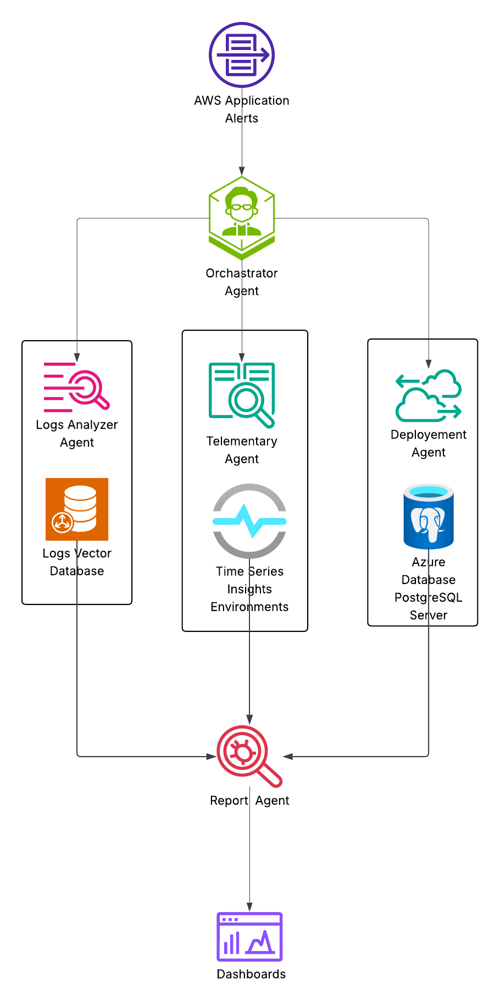

# Cloud-Monitoring
Bayers hackathon project

---

## 🚀 Quick Start

### Prerequisites
- Python 3.12+
- uv package manager

### Setup

```bash
# Navigate to project directory
cd Cloud-Monitoring

# Create virtual environment
uv venv --python 3.12

# Activate virtual environment
source .venv/bin/activate  # On macOS/Linux
# .venv\Scripts\activate  # On Windows

# Install dependencies
uv pip install -e .
```

### Configuration

Create a `.env` file with your API keys:

```bash
GEMINI_API_KEY="your-gemini-api-key"
LANGFUSE_SECRET_KEY="your-langfuse-secret-key"
LANGFUSE_PUBLIC_KEY="your-langfuse-public-key"
LANGFUSE_HOST="https://cloud.langfuse.com"

# LLM Provider Configuration
LLM_PROVIDER="gemini"  # Options: gemini, anthropic
GEMINI_MODEL="gemini-pro"
# For Anthropic Claude:
# LLM_PROVIDER="anthropic"
# ANTHROPIC_API_KEY="your-anthropic-key"
# ANTHROPIC_MODEL="claude-3-5-sonnet-20241022"
```

### Run

```bash
python main.py
```

Output will be saved to `incident_report.txt`

---

## 🔍 Logs Agent

**Infer intent → Scope → Filter → Reason → Explain**

* **Infer intent**
  Understand *what kind of failure to look for* from the alert
  (latency → blocking, error-rate → crashes, memory → leaks)

* **Scope**
  Narrow logs by **service + time window + severity** to remove noise

* **Filter**
  Apply intent-driven search (patterns, keywords, elastic queries)

* **Reason**
  Convert repeated log patterns into a failure class
  (DB timeout, thread exhaustion, external API failure)

* **Explain**
  Output clear evidence and conclusion for the commander

👉 *Answers:* **“What is failing?”**

---

## 📊 Telemetry Agent

**Window → Select metrics → Analyze shapes → Correlate → Explain**

* **Window**
  Look at metrics **before, during, after** the alert

* **Select metrics**
  Pull only metrics relevant to the alert type
  (latency, CPU, memory, RPS)

* **Analyze shapes**
  Detect patterns: sudden vs gradual, spike vs saturation

* **Correlate**
  Compare metrics together to identify system behavior
  (blocking, overload, degradation)

* **Explain**
  Summarize how the system behaved with supporting evidence

👉 *Answers:* **“How did the system behave?”**

---

## 🚀 Deployment (CI/CD) Agent

**Normalize → Filter by time → Filter by impact → Rank → Explain**

* **Normalize**
  Convert raw CI/CD events into canonical change types
  (code, config, feature flag, infra)

* **Filter by time**
  Keep only changes close to the incident

* **Filter by impact**
  Remove changes that *cannot* cause this kind of incident

* **Rank**
  Score remaining changes by risk and relevance

* **Explain**
  Output most likely change(s) with reasoning and confidence

👉 *Answers:* **“What change could have caused this?”**

---

## 🧠 One-line summary for the team

* **Logs Agent:** *Finds what broke*
* **Telemetry Agent:** *Explains system behavior*
* **Deployment Agent:** *Finds the risky change*

Together they produce:

> **Root cause = behavior + evidence + change correlation**


